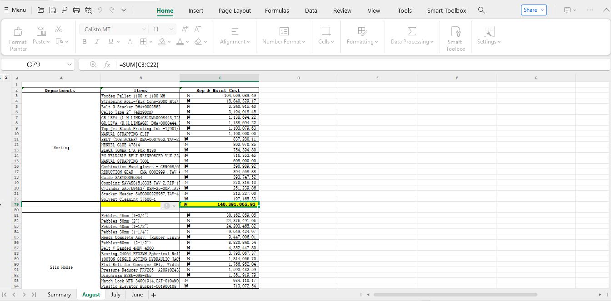
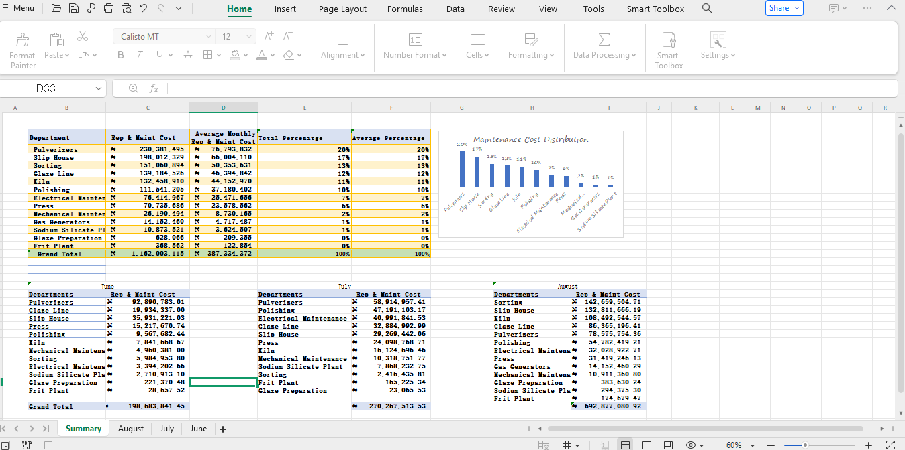

# Machinery Spare Parts Consumption Analysis

## Project Overview

Efficient inventory management is essential in industrial operations, particularly when dealing with machinery spare parts. Lack of visibility into spare parts consumption can result in stock shortages, overstocking, increased downtime, and higher operational costs.

This project focuses on analyzing machinery spare parts consumption data to identify **high-consumption spare parts**, understand usage patterns, and support **data-driven inventory management decisions**.

The analysis aims to help maintenance teams, procurement departments, and operations managers optimize spare parts inventory and improve maintenance planning.

---

## Objectives

The main objectives of this project are to:

- Analyze historical spare parts consumption data, across various department
- Identify spare parts with **high usage rates**
- Detect **usage patterns and trends**
- Highlight **critical components** that require frequent replacement
- Provide insights for **inventory optimization**
- Support **better procurement and maintenance planning**

---

## Problem Statement

In many industrial environments, spare parts inventories are managed without deep analytical insights into usage patterns. This can lead to:

- Overstocking of rarely used spare parts
- Shortage of frequently used components
- Increased machine downtime
- Inefficient procurement decisions

Through data analysis, this project identifies the spare parts that are consumed most frequently and should therefore receive **priority in inventory management**.

---

## Dataset Description

The dataset used in this project contains records related to machinery spare parts usage and inventory activity.

Typical dataset features include:

| Column | Description |
|------|-------------|
| Department | department where of consumption |
| Rep & Main Cost | Repair and maintenance Cost |
| Average Monthly Rep & Main Cost | Average Repair and Maintenance cost for the period of 3month |
| Total Percentage | Various department spending percentages |
| Total Average Percentage | Average Percentage |

The dataset may originate from:

- Maintenance logs
- Inventory management systems
- ERP systems
- Spare parts request records
- Store issued records

---

## Methodology

The project follows a structured data analysis workflow:

### 1. Data Collection
Spare parts consumption data is gathered from maintenance and inventory systems, store issue logs.

### 2. Data Cleaning
Data preprocessing steps include:

- Handling missing values
- Removing duplicates
- Standardizing part names and IDs
- Formatting date fields
- all using excel
- 

### 3. Consumption Analysis

Key metrics calculated include:

- Total consumption per spare part
- Average usage rate
- Monthly consumption trends
- Machine-specific spare part demand

### 4. Identification of High-Consumption Parts

Spare parts are ranked based on:

- Total quantity consumed
- Frequency of replacement
- Operational importance
- Based on department

This helps identify **critical spare parts that require priority stocking**.

## Tools and Technologies

This project uses the following tools:

- **Excel datasets**
- **Excel Pivot table**

---

## Example Analysis Outputs

Expected outputs from this project include:

- Ranking of spare parts by consumption for the period of 3months
- Identification of top 10 high-consumption spare parts
- Machine-level spare parts usage analysis
- Spare parts cost impact analysis
- Inventory optimization recommendations

---

## Potential Applications

Insights generated from this analysis can be used for:

- Inventory management optimization
- Procurement planning
- Predictive maintenance strategies
- Reducing machinery downtime
- Maintenance cost control

---

Data Analytics | Operations Analysis

---

## License

This project is licensed under the **MIT License**.
